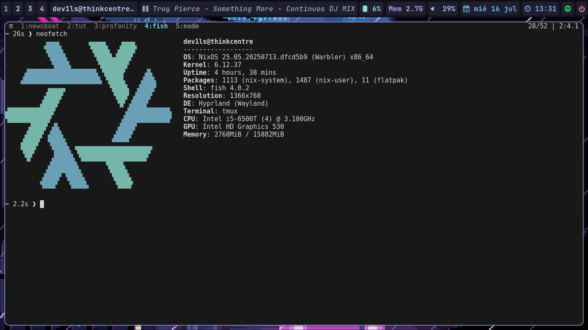

# dev1lsconf/nixos-config

Esta es mi **configuración personal de NixOS** [1].

## Versión de NixOS

Esta configuración está diseñada para ser utilizada con **NixOS versión 25.05**. Tenga en cuenta que la especificación de la versión 25.05 de NixOS proviene de su consulta y no se encuentra explícitamente en las fuentes proporcionadas, pero se basa en la práctica de nombrar las versiones de NixOS por año y mes.

## Uso de Nix Flakes

Esta configuración de NixOS aprovecha las **Nix Flakes** para una gestión de dependencias y una reproducibilidad mejoradas. La estructura del repositorio incluye archivos clave como **`flake.nix`** y **`flake.lock`** [2], que son fundamentales para este enfoque basado en Flakes. Esto permite una forma más estructurada y reproducible de construir y desplegar el sistema.

## Configuración Modular

El diseño de esta configuración de NixOS es **altamente modular**, lo que facilita su mantenimiento, comprensión y extensión. La configuración se organiza en una serie de archivos `.nix` dedicados, así como en un directorio **`modules/`** [2] para componentes personalizados. Este enfoque modular garantiza que las diferentes partes de la configuración se puedan gestionar de forma independiente y se reutilicen fácilmente.

Los componentes clave de esta configuración modular incluyen:

*   **`modules/`** [2]: Este directorio es el corazón de la **modularidad** de esta configuración. Contiene **módulos de configuración personalizados**, lo que permite agrupar lógicamente configuraciones específicas o funcionalidades adicionales. Aunque los siguientes archivos no se enumeran explícitamente en la vista de carpetas y archivos proporcionada de este repositorio [2], son **ejemplos comunes** de cómo se utiliza la modularidad dentro de la carpeta `modules/` en una configuración de NixOS:
    *   **`desktop.nix`**: Este módulo se enfocaría en la **configuración del entorno de escritorio** y la experiencia de usuario visual. Típicamente incluiría la configuración de tu gestor de ventanas o entorno de escritorio (como GNOME, KDE Plasma, Hyprland, i3, etc.), aplicaciones gráficas específicas, ajustes de fuentes, temas, iconos y otros elementos de la interfaz de usuario, así como configuraciones para servidores de pantalla (Xorg o Wayland).
    *   **`services.nix`**: Este módulo estaría dedicado a la **definición y configuración de los servicios del sistema** que se ejecutan en segundo plano. Podría incluir configuraciones para servicios de red (como `networking.networkmanager` o `wireguard`), servidores (como `nginx` para un servidor web, `postgresql` para una base de datos), daemons o procesos en segundo plano (como un servidor SSH (`openssh`)), y configuraciones para `systemd` units personalizadas.
    *   **`user.nix`**: Este módulo podría definirse para **usuarios y grupos del sistema** de manera modular, o para configuraciones específicas de usuario que no son gestionadas por Home Manager (si se usa con `home.nix`) o que se aplican a nivel de sistema para un usuario particular.

*   **`configuration.nix`** [2]: Es el **archivo principal de configuración del sistema** NixOS, que orquesta la inclusión de los demás módulos.

*   **`home.nix`** [2]: Dedicado a la **configuración a nivel de usuario**, gestionando aspectos como los programas instalados por el usuario y sus configuraciones de `dotfiles`.

*   **`hardware-configuration.nix`** [2]: Contiene la **configuración específica del hardware** de la máquina, como las definiciones de discos y interfaces de red.

*   **`security.nix`** [2]: Un archivo específico para la **configuración de aspectos de seguridad** del sistema.

Esta estructura contribuye a una configuración de sistema organizada y clara.

## Idioma

Todo el código de configuración de este repositorio está escrito en **Nix**, constituyendo el **100.0%** de los lenguajes de programación utilizados [3].
